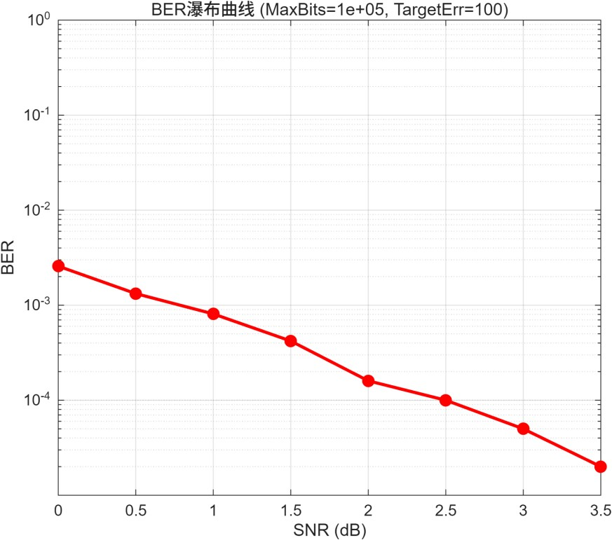
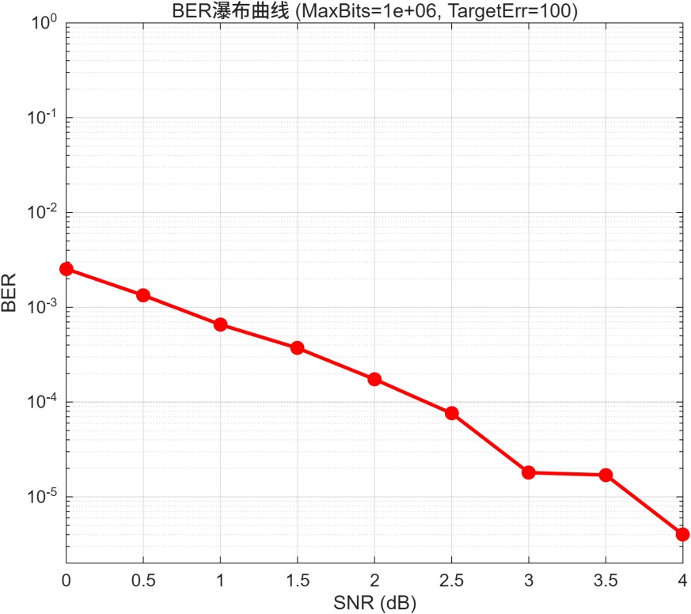
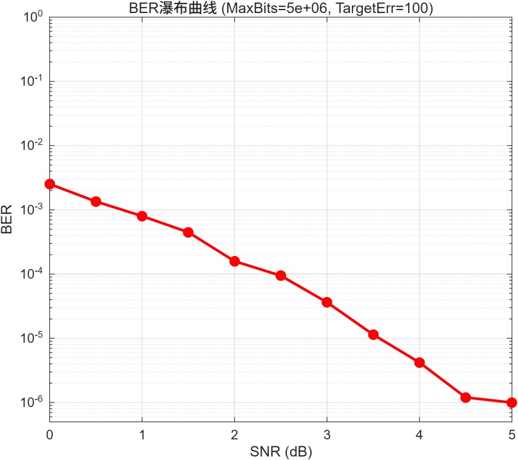
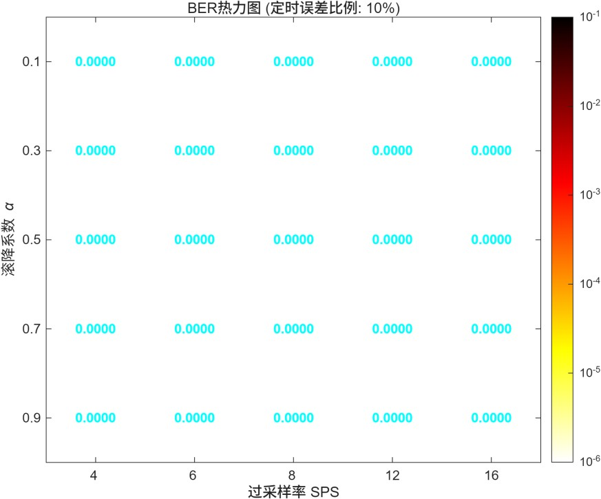
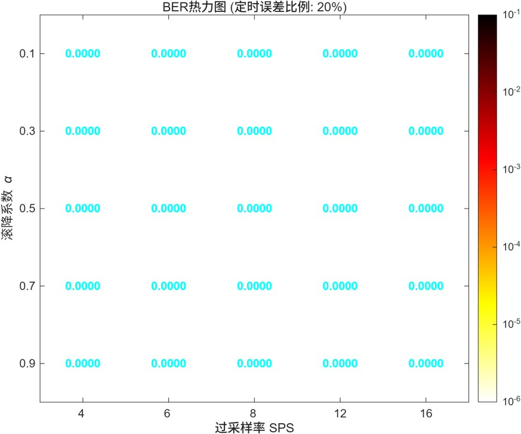
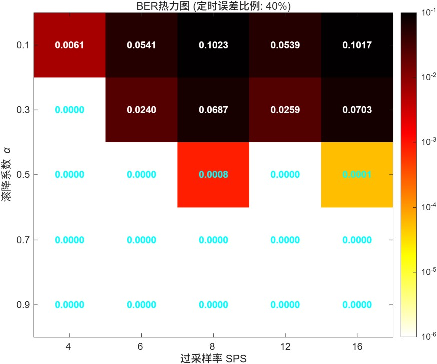

# 通信原理课程实训作业1-实验报告

| 成员   | 学号     | 分工任务                                                                                                               | 贡献率 |
| ------ | -------- | ---------------------------------------------------------------------------------------------------------------------- | ------ |
| 陈意欣 | 23336049 | 实现对二级制数据的编码<br>探究不同编码方式在相同基线噪声下对误码率的影响<br>设计部分响应系统                           | 50%    |
| 陈宝怡 | 23336029 | 构造多种信道模型<br>探究噪声变化对误码及图像恢复质量的影响<br>探究不同码元发送速率与带宽设置对误码及图像恢复质量的影响 | 50%    |

## 一、实验内容
1. 读入校徽图像的位图二进制数据,选择一种编码表示读入的二进制数据(如单极性、双极性、差分等)。
2. 基于Matlab通信工具箱构建“升余弦滚降系统仿真”连接A与B。
3. 通信系统加入噪声信号,例如:高斯白噪声;
4. 在B端接收信号并恢复校徽图像。
5. 评估噪声变化对误码及图像恢复质量的影响;评估不同码元发送速率与带宽设置对误码及图像恢复质量的影响。
6. 自己设计的拓展内容(例如:部分响应系统)
## 二、实验原理

### 2.1 基带传输系统模型

数字基带传输系统是在不使用载波调制的情况下，直接传输数字基带信号。本次实验以**校徽二值图像**作为信源，构建完整的基带传输链路：

信源（图像比特流）→ 基带编码 → 发送滤波 → 高斯白噪声信道 → 接收匹配滤波 → 抽样判决 → 信宿（恢复图像）

### 2.2 升余弦滚降滤波

升余弦滚降滤波器是**无码间串扰（ISI）传输的核心器件**，用于控制信号带宽并使符号在抽样点无串扰。
它由**发送端成型滤波器**和**接收端匹配滤波器**组成，均采用平方根升余弦结构。

**核心作用**
1. 限制信号带宽，避免频率扩散。
2. 使符号在抽样时刻无码间串扰。
3. 滚降系数 α 决定带宽大小：α 越大，带宽越宽，波形越平滑。

**伪代码**
```matlab
% 系数
alpha = 0.5;        % 滚降系数 α
span = 6;           % 滤波器符号跨度
sps = 8;            % 每个符号采样数
rrc_filter = rcosdesign(alpha, span, sps, 'sqrt');

% 发送端成型滤波
tx_wave = upfirdn(符号序列, rrc_filter, sps);

% 接收端匹配滤波
rx_filt = upfirdn(rx_wave, rrc_filter, 1, sps);
```

### 2.3 信道建模

高斯白噪声（AWGN）是通信系统中最典型的噪声模型，其幅度服从高斯分布，功率谱均匀。
噪声会导致判决错误，使**误码率 BER 上升**，图像恢复质量下降。

**作用**
- 改变信噪比 SNR 观察系统性能。
- 使用 MATLAB 内置函数 `awgn` 模拟噪声。

**伪代码**
```matlab
SNR = 5; % 设置信噪比 
rx_wave = awgn(tx_wave, SNR, 'measured');
```
**拓展**
为了进一步评估基带传输在真实物理环境下的鲁棒性，实验在基线（高斯白噪声）基础上模拟了另外三种经典信道环境，测试噪声变化对于恢复图片质量的影响。
- 突发脉冲噪声：模拟电线干扰或突发电磁攻击。其特点是在极短的时间内出现高幅度脉冲，时域表现为不连续的尖峰，这会导致局部比特流的大面积连续错误。
- 瑞利衰落：模拟移动通信中的多径传输。其特点是信号通过多个路径到达接收端，导致信号包络随着时间随机起伏，服从瑞利分布。这会导致信噪比在发生瞬时下降，破坏图像分布。
- 单频正弦干扰：模拟窄带电波干扰。其特点是在频域上表现为特定频率处的能量集中，若干扰频率落入信号带宽内，将显著降低判决区域内的清晰度。模型公式为$J(t) = A \cos(2\pi f_0 t)$

### 2.4 基带编码原理

基带编码将二进制比特映射为可传输的电平波形，影响系统的**抗噪声能力、定时提取、带宽**。
本次实验实现 3 种标准编码。

#### 2.4.1 单极性不归零

0→0，1→1，简单但有直流分量。
```matlab
sym_unrz = tx_bits;
```

#### 2.4.2 双极性不归零

0→-1，1→+1，无直流，抗噪声性能最优。
```matlab
sym_bnrz = 2 * tx_bits - 1;
```

#### 2.4.3 差分编码

用相邻比特的变化 / 不变表示信息，抗相位翻转。
```matlab
d = zeros(1, num_bits);
d(1) = tx_bits(1);
for i = 2:num_bits
    d(i) = xor(tx_bits(i), d(i-1));
end
sym_diff = 2*d - 1;
```
### 2.5 性能评估理论
在探究噪声变化和码元速率、带宽等对于图像恢复质量的影响中，引入蒙特卡洛统计评估理论。使用误码率作为评估指标。
- 统计置信度：在低误码率区域（高SNR），若传输少量比特，误差随机性比较大。通过蒙特卡洛仿真，设定目标错误数作为停止条件，以确保实验结果的统计方差控制在合理范围内，
- 瀑布曲线：通过对SNR进行扫描，绘制$\log(BER) - SNR$曲线，可定量描述系统抗噪能力的变化趋势。
- 定时抖动容忍度：当接收端采样时钟发生偏移时，会引入码间串扰。通过热力图分析不同α与1过采样率组合下的误码表现，可以找出系统在特定抖动环境下的最优参数边界。
### 2.6 拓展：第 Ⅰ 类部分响应系统（PR1）

第 Ⅰ 类部分响应（PR1）是**人为引入可控码间串扰**，以实现 **高频带利用率（2 Baud/Hz）** 的传输技术。
通过在发送端引入受控的码间干扰（ISI），在接收端利用已知的干扰规律进行恢复，从而获得更高的频带利用率，以达到**奈奎斯特速率极限**。

**过程**
- 发送波形：**当前符号 + 前一符号**
- 输出电平：+2、0、-2
- 使用**预编码**避免差错传播
- 接收端**直接电平判决**，无需复杂运算

**伪代码**
PR1系统的传输特性为：
```matlab
c_k = a_k + a_{k-1}
```
其中，`a_k ∈ {-1, +1}` 为双极性符号，`c_k ∈ {-2, 0, +2}` 为三电平输出。
为了避免差错传播，PR1系统采用预编码：
```matlab
d_k = x_k ⊕ d_{k-1}
```
接收端译码：
```matlab
1. 判决 d_k:  
   c_k > 0 → d_k = 1, 
   c_k < 0 → d_k = 0, 
   c_k ≈ 0 → d_k = ¬d_{k-1}
2. 恢复 x_k: x_k = d_k ⊕ d_{k-1}
```
## 三、实验过程

### 3.1 实验基础框架搭建

本实验的基础框架围绕”图像比特流 → 基带编码 → 脉冲成形 → AWGN信道 → 匹配滤波 → 抽样判决 → 图像恢复“这一典型数字基带传输链路构建。所有仿真在 MATLAB 环境下完成。
#### 3.1.1 系统参数设置

系统相关参数如下：
- SNR：固定信噪比，用于编码性能横向对比，保证噪声强度一致。
- alpha：升余弦滚降系数，控制信号带宽与波形平滑度，α 越大带宽越宽、拖尾衰减越快。
- span：滤波器时域跨度（符号数），决定滤波器长度（`span * sps + 1`），影响计算复杂度与截断误差。
- sps：每个符号的采样点数，过采样率越高波形越精细，但计算量增大。

#### 3.1.2 图像信源处理

```matlab
img_matrix = imread('sysu_logo.bmp'); 
img_matrix = im2bw(img_matrix, 0.5); 
[img_height, img_width] = size(img_matrix);
tx_bits = img_matrix(:)'; 
num_bits = length(tx_bits);
tx_bits = double(tx_bits);
```
- 读取校徽二值图像 `sysu_logo.bmp`
- 使用 `im2bw` 转换为二值逻辑矩阵
- 将图像矩阵按行展开为一维比特流 `tx_bits`，作为原始信源序列，便于串行传输。

#### 3.1.3 平方根升余弦滤波器生成
```matlab
rrc_filter = rcosdesign(alpha, span, sps, 'sqrt');
```
- `rcosdesign`：MATLAB 内置函数，设计升余弦滤波器系数。
- `'sqrt'`：生成平方根升余弦（RRC）滤波器，发送端和接收端各使用一个相同的 RRC 滤波器，组合后整体等效为升余弦滤波器，实现无码间串扰传输。

#### 3.1.4 发送端脉冲成形

```matlab
tx_wave = upfirdn(sym_unipolar_nrz, rrc_filter, sps);
```
- upfirdn：先上采样（插零），再进行 FIR 滤波。
- 参数 sps：表示上采样因子，每个符号插入 sps-1 个零。
- 输出 tx_wave：连续时间波形（离散采样序列），准备送入信道。

#### 3.1.5 接收端匹配滤波与下采样

```matlab
rx_filt = upfirdn(rx_wave, rrc_filter, 1, sps);
rx_samp = rx_filt(span+1 : span+num_bits);
```
- `upfirdn(..., 1, sps)`：下采样因子为 `sps`，即每 `sps` 个采样点输出一个符号，同时与匹配滤波器卷积。
- `rx_filt(span+1 : span+num_bits)`：去除滤波器引入的群延迟（滤波器长度为 `span*sps+1`，延迟 `span` 个符号），提取最佳抽样点。

#### 3.1.6 图像恢复（以双极性 NRZ 为例）

```matlab
img_original = reshape(tx_bits, img_height, img_width);
img_bipolar_nrz = reshape(bits_bipolar_nrz, img_height, img_width);
```
- `reshape`：将一维比特向量恢复为原始图像尺寸的二维矩阵。

### 3.2 多编码实现

#### 3.2.1 系统方案设计

在 3.1 节统一框架基础上，仅修改比特到符号的映射规则及接收端的逆映射与判决方式，实现三种编码的横向对比。以下结合代码逐一分析。

#### 3.2.2 单极性不归零

```matlab
sym_unipolar_nrz = tx_bits;                     % 映射：0→0, 1→1
tx_wave = upfirdn(sym_unipolar_nrz, rrc_filter, sps);
rx_wave = awgn(tx_wave, SNR, 'measured');
rx_filt = upfirdn(rx_wave, rrc_filter, 1, sps);
rx_samp = rx_filt(span+1 : span+num_bits);
bits_unipolar_nrz = rx_samp > 0.5;              % 判决门限 0.5
BER_unipolar_nrz = sum(tx_bits ~= bits_unipolar_nrz) / num_bits;
```
- **映射规则**：直接使用原始比特值 0/1。
- **判决门限 0.5**：噪声干扰后，接收值大于 0.5 判为 1，否则判为 0。    
- **缺点**：存在直流分量，能量效率低，判决门限易受直流漂移影响。

#### 3.2.3 双极性不归零

```matlab
sym_bipolar_nrz = 2 * tx_bits - 1;
tx_wave = upfirdn(sym_bipolar_nrz, rrc_filter, sps);
rx_wave = awgn(tx_wave, SNR, 'measured');
rx_filt = upfirdn(rx_wave, rrc_filter, 1, sps);
rx_samp = rx_filt(span+1 : span+num_bits);
bits_bipolar_nrz = rx_samp > 0;
BER_bipolar_nrz = sum(tx_bits ~= bits_bipolar_nrz) / num_bits;
```
- **映射规则**：`2 * tx_bits - 1`，将 0 变为 -1，1 变为 +1。
- **判决门限 0**：符号 ±1 在零电平处判决，抗干扰能力最强。
- **优点**：无直流分量，能量效率高，是基带传输中最常用编码。

#### 3.2.4 差分编码

```matlab
sym_diff = zeros(1, num_bits);
sym_diff(1) = tx_bits(1);
for i = 2:num_bits
    sym_diff(i) = xor(sym_diff(i-1), tx_bits(i));
end
sym_diff = 2 * sym_diff - 1;
tx_wave = upfirdn(sym_diff, rrc_filter, sps);
rx_wave = awgn(tx_wave, SNR, 'measured');
rx_filt = upfirdn(rx_wave, rrc_filter, 1, sps);
rx_samp = rx_filt(span+1 : span+num_bits);
rx_bin = rx_samp > 0;
bits_diff = zeros(1, num_bits);
bits_diff(1) = rx_bin(1);
for i = 2:num_bits
    bits_diff(i) = xor(rx_bin(i-1), rx_bin(i));
end
BER_diff = sum(tx_bits ~= bits_diff) / num_bits;
```
- **发送端编码**：当前发送符号与前一符号的异或结果表示原始比特。若 `tx_bits(i) = 0`，则 `sym_diff(i) = sym_diff(i-1)`（不变）；若 `=1`，则取反。
- **双极性映射**：将 0/1 逻辑映射为 ±1 符号。
- **接收端判决**：先对 `rx_samp` 进行双极性判决（门限 0）得到 `rx_bin`。
- **差分解码**：当前比特 = 相邻两个判决结果的异或，无需知道绝对相位。
- **优点**：抗相位翻转（如 BPSK 中的 π 相位模糊），适用于极性不确定的信道。

#### 3.2.5 结果分析

##### **系统参数**
```matlab
SNR = 1; % 固定噪声
alpha = 0.5; % 滚降系数
span = 6; % 滤波器符号数
sps = 8; % 过采样率
```

##### **运行结果**
![!\[\[编码比较png结果.png\]\]](result/编码比较结果.png)

| 编码类型   | BER      | 相对性能排名 |
| ---------- | -------- | ------------ |
| 双极性 NRZ | 0.000648 | 最优         |
| 差分码     | 0.001373 | 次优         |
| 单极性 NRZ | 0.013596 | 最差         |

##### **实验结果符合预期**
- 双极性 NRZ 的抗噪声性能在三者中最强。
- 差分编码本身不改变抗噪声能力，与双极性 NRZ 理论上应有相同的 BER，但差分解码存在**错误传播效应**：一个判决错误会导致连续两个比特恢复错误，实验中差分码的 BER 约为双极性 NRZ 的 2.3 倍，与理论预期（2倍左右）吻合，验证了错误传播效应的存在。
- 单极性 NRZ 比双极性 NRZ **损失 3 dB 的信噪比**，因此 BER 显著更高。在 SNR=1dB 的低信噪比环境下，3 dB 的能量劣势被急剧放大，导致 BER 相差近 20 倍，符合通信原理中 **BER-SNR 曲线的非线性特征**。

#### 3.2.6 问题

在编码比较实验中，本来还选择了单极性和双极性的归零编码。
以单极性归零编码为例：在实验中通过**符号速率、过采样率与脉冲成形滤波器**共同作用的频域特性来间接实现半个周期置零。
```matlab
sym_rz_explicit = zeros(1, num_bits * 2);  % 每个比特扩展为2个符号周期
for i = 1:num_bits
    sym_rz_explicit(2*i-1) = tx_bits(i);   % 前半周期为信号电平
    sym_rz_explicit(2*i)   = 0;             % 后半周期归零
end
tx_wave_rz = upfirdn(sym_rz_explicit, rrc_filter, sps);
```
但同时产生了新的问题：**滤波器参数未随符号率调整**，相当于符号率翻倍但滤波器带宽未相应增加。
对于 RZ 编码，虽然符号率理论上应翻倍，但为了保持系统参数一致以便横向对比 BER 性能，于是并未单独调整滤波器带宽。
理论上这一简化会使 RZ 编码的 BER 结果略高于理论值，可是结果为
```
===== 五种编码对比结果 ===== 
单极性 NRZ BER = 0.014187 
单极性 RZ BER = 0.000667 
双极性 NRZ BER = 0.000934 
双极性 RZ BER = 0.000019 
差分码 BER = 0.001373
```
这一结果**严重偏离预期**，于是我认为应该是**RZ 的能量归一化问题**。
于是我进行了能量补偿
```matlab
sym_unipolar_rz(2*i-1) = tx_bits(i) * sqrt(2);  % 能量补偿：幅度提高 √2 倍
```
但补偿能量后结果仍然不符合理论预期。
```
===== 五种编码对比结果 ===== 
单极性 NRZ BER = 0.014817 
单极性 RZ BER = 0.007265 
双极性 NRZ BER = 0.000973 
双极性 RZ BER = 0.000000 
差分码 BER = 0.001335
```
单极性 RZ 的 BER 仍然低于单极性 NRZ，而双极性 RZ 达到0 误码。
原因可能是RZ 的抽样点选择错误（经过 `upfirdn` 和滤波后，**波形峰值并不在第一个采样点**）或者滤波器群延迟未精确补偿。
但考虑到RZ 编码在工程中主要用于时钟同步提取，由于符号率翻倍导致与滤波器带宽不匹配，且抽样点对齐存在理论复杂性，其 BER 绝对数值仅可作参考，于是最终还是放弃了 RZ 的 BER 对比。
### 3.3 探究影响因素
#### 3.3.1 噪声变化对图像恢复质量的影响
为了评估不同噪声环境对数据基带系统性能的影响，实验基于双极性NRZ编码与平方根升余弦匹配滤波系统，模拟了四种经典信道模型。
- 纯AWGN信道
```matlab
rx_signal_awgn = awgn(tx_signal, target_snr, 'measured');
```
- AWGN+突发脉冲噪声
```matlab
impulse_noise = (rand(size(tx_signal)) < impulse_prob) .* impulse_amp .* sign(randn(size(tx_signal)));
rx_signal_burst = rx_signal_awgn + impulse_noise;
```
- AWGN+瑞利平坦衰落信道
```matlab
rayleigh_env = sqrt(randn(size(tx_signal)).^2 + randn(size(tx_signal)).^2) / sqrt(2); 
rx_signal_rayleigh = tx_signal .* rayleigh_env;
rx_signal_rayleigh = awgn(rx_signal_rayleigh, target_snr, 'measured');
```
- AWGN+单频连续波干扰
```matlab
t = 1:length(tx_signal);
jamming_amp = 1.5; % 干扰信号强度
jamming_signal = jamming_amp * cos(2 * pi * 0.15 * t); 
rx_signal_jamming = rx_signal_awgn + jamming_signal;
```
##### 系统实现
- 发送端首先将图像比特映射为双极性符号：
```matlab
tx_symbols = 2 * tx_bits - 1;
```
- 随后采用平方根升余弦滤波器进行脉冲成形：
```matlab
h_rrc = rcosdesign(alpha, span, sps, 'sqrt');
tx_signal = upfirdn(tx_symbols, h_rrc, sps);
```
- 在 AWGN 基础上，实验进一步叠加不同类型噪声.
- 接收端经过匹配滤波、抽样判决后恢复图像，并统计 BER：
```matlab
rx_symbols_filtered = upfirdn(rx_signal, h_rrc, 1, sps);
rx_bits = rx_symbols_sync > 0;
BER = sum(tx_bits ~= rx_bits) / num_bits;
```
##### 实验结果
SNR8-Prob0.001

SNR8-Prob0.005

SNR8-Prob0.10

SNR8-Prob0.50

- 纯AQGN信道，在不同SNR下误码率始终保持0.0000，证明在理想的高斯白噪声环境下，当前的发射功率已经足够大了，双极性码配合接受端的升余弦匹配滤波器能够在最佳抽样点进行无误码判决。
- 引入突发脉冲噪声后，随着脉冲概率由0.001增加到0.050，误码率从0.0058增加至0.2360，图像上的椒盐噪声越来越密集。突发干扰的瞬时幅度远远大于信号本身的幅度，直接超过系统的判决门限，无法通过常规的基带滤波滤除。这证明了在工程上引入信道纠错编码的必要性。
- 还可以注意到在瑞利衰落信道下，测试中的BER竟然为0。实验中采用瑞利信道的包络去乘上发送信号，这意味着信号会随机变大变小，但正负极不变。在双极性编码下，判决门限为0V，因此即使信号衰弱只要加上噪声没有越过0，判决结果依然正确。相比单极性信号具有更强的鲁棒性。
- 引入单频正弦干扰下，接收端图像BER依然为0。代码中我们设置正弦干扰归一化频率为0.15，而我们系统的基带带宽由公式 $B = \frac{1+\alpha}{2 \cdot sps}$ 决定，代入 $\alpha=0.5, sps=8$ 后，系统的实际通带边缘在频域上小于 $0.10$。这个高频干扰信号在进入接收端判决器之前已经被滤除，验证了升余弦匹配滤波的强抗干扰能力。

#### 3.3.2 噪声统计置信度对BER曲线的影响
为提高BER曲线的统计可靠性，实验采用蒙塔卡洛方法进行误码率统计，探究不同最大比特数对BER曲线的稳定性影响。
##### 系统实现
- 实验设置在每个SNR下循环发送随机比特流
```matlab
target_errs = 100;
max_bits_test = [1e5, 1e6, 5e6];
```
- 直到误码率达到目标值或发送比特数达到上限
```matlab
while (total_errors < target_errors) && (total_bits < max_bits)
```
- 最终绘制 BER 瀑布曲线
```matlab
semilogy(SNRs_test, BER_results);
```
##### 实验结果



- 对比不同置信度下的瀑布曲线结果，可以观察到随着发射比特数量的增加，系统极限误码率的下限降低。在MaxBits=5e+06 SNR<2dB时，误码率偏大，通信质量差，而在2~5dB区间，误码率出现垂直下降。可见基带数字传输系统存在一个工作门限，在无纠错码的链路中，为保障图像传输的正确性，系统链路应保证至少4.5dB以上的信噪比。
- 同时，由于本实验中单张图片样本量太小，在SNR=4dB时会出现零误码，使用蒙特卡洛连续发包能够更加准确地反应通信系统在传输上的性能。
#### 3.3.3 码元速率与带宽设置对系统性能的影响
为探究码元发送速率与系统带宽之间的关系，实验通过改变过采样率SPS与升余弦滚降系数α，观察不同参数组合下系统BER的变化。
##### 系统实现
- 实验设置不同参数组合，其中alpha_test越大，表示系统带宽越宽，sps_test越大，符号采样越精细，但系统开销增大。
```matlab
alphas_test = [0.1, 0.3, 0.5, 0.7, 0.9];
sps_test = [4, 6, 8, 12, 16];
```
- 引入定时抖动以模拟实际通信系统中的时钟同步误差。
```matlab
jitter_samples = floor(sps * jitter_ratio);
rx_signal_jitter = circshift(rx_signal, [0, jitter_samples]);
```
##### 实验结论
- 当定时抖动幅度较小（10%~20%），测试不同滚降系数和过采样率参数组合，误码率都稳定在0.0000，验证了实验中升余弦滤波器系统具备良好的鲁棒性。


- 但当定时抖动幅度增加至40%时，滚降系数=0.1/0.3的区域误码率极高，而滚降系数较大的区域依然维持着低误码率甚至零误码。这是因为滚降系数越小，最然节省了频谱带宽资源，但其时域波形的拖尾振荡剧烈。一旦接收端的时钟同步出现较大偏差，采样点就会落入波行的振荡峰值中，引发极大的码间串扰现象。因此在实际工程应用中，如果通信设备处于高速移动或者时钟同步极不稳定的环境中，应当考虑适当牺牲带宽以换取系统的稳定性。

### 3.4 扩展内容

#### 3.4.1 系统方案设计

PR1系统的核心思想是在发送端引入可控的码间干扰，在接收端利用这种干扰的规律性来恢复原始数据。
1. **预编码**：为避免差错传播，首先对原始比特进行预编码：`d_k = x_k ⊕ d_{k-1}`。
2. **双极性映射**：将二进制序列`d_k`映射为双极性符号`a_k = 2·d_k - 1`，其中`a_k ∈ {-1, +1}`。
3. **PR1编码**：在发送端引入相关性，编码规则为`c_k = a_k + a_{k-1}`，输出三电平信号`c_k ∈ {-2, 0, +2}`。
4. **接收端处理**：接收端采用匹配滤波器（与发送矩形脉冲匹配）以最大化信噪比，并在符号周期末端进行最佳采样。
5. **译码**：基于三电平判决规则先恢复`d_k`，再通过差分译码得到原始比特`x_k`。
#### 3.4.2 PR1编码实现

```matlab
%% ========== 发送端 ==========
% 步骤1: 预编码 d_k = x_k ⊕ d_{k-1}
d = zeros(1, N);
d(1) = tx_bits(1);
for k = 2:N
    d(k) = xor(tx_bits(k), d(k-1));
end

% 步骤2: 双极性映射
a = 2*d - 1;

% 步骤3: PR1编码
c = zeros(1, N);
c(1) = a(1);  % a_1 + a_0
for k = 2:N
    c(k) = a(k) + a(k-1);
end
% c_k ∈ {-2, 0, +2}

% 发送
tx_signal = reshape(repmat(c, sps, 1), 1, N*sps);

%% ========== 信道 ==========
rx_signal = awgn(tx_signal, SNR, 'measured');

%% ========== 接收端 ==========
% 1. 匹配滤波
matched_filter = ones(1, sps) / sps;  % 归一化
rx_filtered = filter(matched_filter, 1, rx_signal);

% 2. 正确采样点
% 矩形脉冲的最佳采样点在每个符号周期的末端
rx_c = rx_filtered(sps : sps : end);

% 译码
rx_d = zeros(1, N);

threshold = 0.8;
for k = 1:N
    if rx_c(k) > threshold      % 正电平 → +2
        rx_d(k) = 1;
    elseif rx_c(k) < -threshold % 负电平 → -2
        rx_d(k) = 0;
    else                  % 接近0
        if k == 1
            rx_d(k) = 0;  % 假设初始
        else
            rx_d(k) = ~rx_d(k-1);  % c_k=0时，d_k翻转
        end
    end
end

% 2. 恢复原始比特 x_k = d_k ⊕ d_{k-1}
rx_bits = zeros(1, N);
rx_bits(1) = rx_d(1);  % x_1 = d_1 ⊕ d_0, d_0=0
for k = 2:N
    rx_bits(k) = xor(rx_d(k), rx_d(k-1));
end
```

#### 3.4.3 结果分析

在不同信噪比下进行仿真，得到PR1系统的误码率(BER)性能如下表所示:
![[PR1.png]]
BER=5 时的图像恢复结果：
![[PR1_2.png]]

实验结果表明，该系统存在明显的“门限效应”
- 当SNR低于4dB时，BER较高，图像恢复质量差；
- 当SNR达到6dB时，BER急剧下降至约$10^{⁻3}$量级，恢复图像在视觉上与原始图像差异减小。

#### 3.4.4 问题及解决

##### 错误1：译码逻辑错误
一开始BER高达0.404，系统完全不工作。经过分析发现译码错误从三电平c_k直接尝试恢复x_k。
```matlab
% 错误的译码实现
for k = 1:N
    if rx_c(k) > 0
        current_a = 1;
    else
        current_a = -1;
    end
    rx_bits(k) = (current_a + 1) / 2;  % 直接得到x_k
end
```
PR1的译码必须分两步进行：先从三电平信号`c_k`判决出预编码后的比特`d_k`，再通过差分运算恢复原始比特`x_k`。直接恢复`x_k`丢失了差分关系中的关键信息，因为`c_k=0`时`d_k`会发生翻转，这个关系无法在`x_k`域直接表达。
修正后BER从0.404到0.280。
##### 错误2：单门限无法区分三电平信号
使用单一门限`>0`判决时，大量判决错误，BER依旧居高不下。
```matlab
% 错误的单门限判决
if rx_c(k) > 0
    rx_d(k) = 1;
else
    rx_d(k) = 0;
end
```
PR1编码输出是三电平信号`c_k ∈ {-2, 0, +2}`，需要用两个门限区分三个区域。单一门限`>0`只能将信号分为正负两个区域，无法正确处理`c_k=0`的情况。当`c_k=0`时，信号应在`+2`和`-2`之间，简单判为正或负都会导致错误。
修正后BER从0.280到0.175。
##### 错误3：零电平判决规则缺失
前面虽然使用了双门限，但`c_k=0`区域的处理逻辑错误，导致BER约0.175。
```matlab
% 错误的零电平处理
else
    rx_d(k) = rx_d(k-1);  % 错误地保持前一状态
end
```
根据PR1编码公式推导，当`c_k=0`时，表示当前比特`d_k`相对于前一比特`d_{k-1}`发生翻转，而非保持不变。
修正后BER从0.175到0.029。
##### 错误4：接收端第一个比特错误使用发送端数据
恢复图像在左上角区域出现与原始图像不符的块状错误。
因为在实际通信系统中，接收端无法获知发送端的任何原始数据，所有信息必须从接收信号中恢复。直接使用`tx_bits(1)`相当于作弊，且当信道有噪声时，第一个比特的错误会影响后续所有比特的译码。
```matlab
rx_bits(1) = rx_d(1);  % 用判决得到的d_1作为第一个比特
```

##### 错误5：匹配滤波器实现错误
添加匹配滤波器后性能反而下降，SNR=10dB时BER从0.029恶化到0.155。
1. **滤波器增益问题**：长度为sps的矩形滤波器增益为sps（即8倍），信号幅度放大8倍，但判决门限仍用0.5，导致大量错误判决。
2. **采样点错误**：矩形脉冲经过匹配滤波后，输出信号呈三角形波形，峰值出现在每个符号周期的**末端**，而非中点。中点采样会错过峰值，降低信噪比。
```matlab
% 正确的匹配滤波器实现
matched_filter = ones(1, sps) / sps;     % 归一化，增益为1
rx_filtered = filter(matched_filter, 1, rx_signal);
rx_c = rx_filtered(sps : sps : end);     % 末端采样（正确！）
threshold = 0.8;                          % 重新调整门限

% 同时调整判决门限
for k = 1:N
    if rx_c(k) > threshold
        rx_d(k) = 1;
    elseif rx_c(k) < -threshold
        rx_d(k) = 0;
    else
        rx_d(k) = ~rx_d(k-1);
    end
end
```
修正后BER从0.155到0.0018
## 四、实验总结
- 本实验成功构建了一套基于升余弦滚降滤波的无码间串扰传输链路，并横向评估了多种编码方案的表现。最终得到的实验结果验证了双极性编码在抗噪性能上的最优性以及差分编码的错误传播效应。
- 为进一步贴近真实传输环境。我们在纯高斯白噪声的基础上，额外构建了三种经典信道模型。实验结果展现了不同干扰机制对图像传输的破坏特点，并验证了双极性判断与匹配滤波在应对特定干扰时的强大鲁棒性。
- 在拓展部分，我们设计并实现了第一类部分响应系统。通过预编码、双极性映射与三电平判决的结合，成功利用受控的码间串扰恢复原始数据，加深了我们对奈奎斯特速率极限与频带利用率的理解。