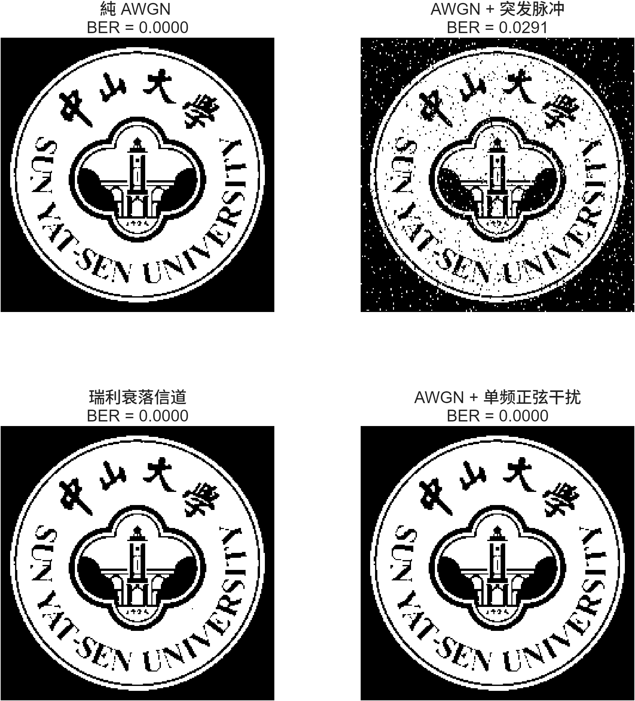
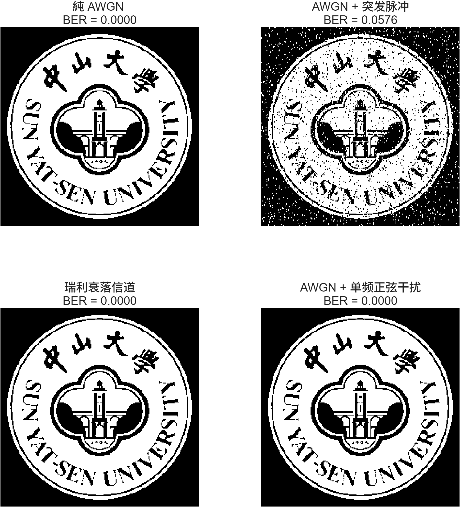
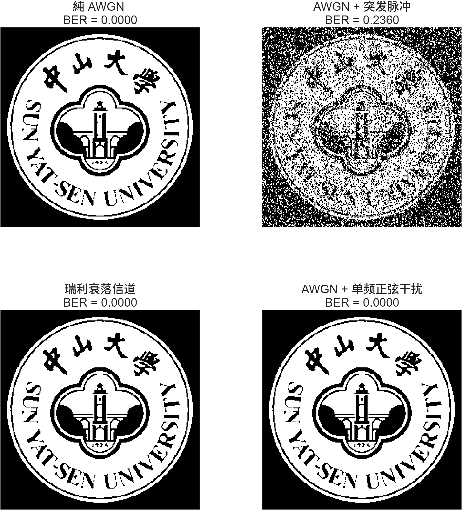

# 通信原理课程实训作业

| 成员   | 学号     | 贡献率 |
| ------ | -------- | ------ |
| 陈意欣 | 23336049 |        |
| 陈宝怡 | 23336029 |        |

## 一、实验内容

![[实验任务.png]]

## 二、实验原理

### 2.1 基带传输系统模型

数字基带传输系统是在不使用载波调制的情况下，直接传输数字基带信号。本次实验以**校徽二值图像**作为信源，构建完整的基带传输链路：

信源（图像比特流）→ 基带编码 → 发送滤波 → 高斯白噪声信道 → 接收匹配滤波 → 抽样判决 → 信宿（恢复图像）

### 2.2 升余弦滚降滤波

升余弦滚降滤波器是**无码间串扰（ISI）传输的核心器件**，用于控制信号带宽并使符号在抽样点无串扰。
它由**发送端成型滤波器**和**接收端匹配滤波器**组成，均采用平方根升余弦结构。

**核心作用**
1. 限制信号带宽，避免频率扩散。
2. 使符号在抽样时刻无码间串扰。
3. 滚降系数 α 决定带宽大小：α 越大，带宽越宽，波形越平滑。

**伪代码**
```matlab
% 系数
alpha = 0.5;        % 滚降系数 α
span = 6;           % 滤波器符号跨度
sps = 8;            % 每个符号采样数
rrc_filter = rcosdesign(alpha, span, sps, 'sqrt');

% 发送端成型滤波
tx_wave = upfirdn(符号序列, rrc_filter, sps);

% 接收端匹配滤波
rx_filt = upfirdn(rx_wave, rrc_filter, 1, sps);
```

### 2.3 信道建模

高斯白噪声（AWGN）是通信系统中最典型的噪声模型，其幅度服从高斯分布，功率谱均匀。
噪声会导致判决错误，使**误码率 BER 上升**，图像恢复质量下降。

**作用**
- 改变信噪比 SNR 观察系统性能。
- 使用 MATLAB 内置函数 `awgn` 模拟噪声。

**伪代码**
```matlab
SNR = 5; % 设置信噪比 
rx_wave = awgn(tx_wave, SNR, 'measured');
```
**拓展**
为了进一步评估基带传输在真实物理环境下的鲁棒性，实验在基线（高斯白噪声）基础上模拟了另外三种经典信道环境，测试噪声变化对于恢复图片质量的影响。
- 突发脉冲噪声：模拟电线干扰或突发电磁攻击。其特点是在极短的时间内出现高幅度脉冲，时域表现为不连续的尖峰，这会导致局部比特流的大面积连续错误。
- 瑞利衰落：模拟移动通信中的多径传输。其特点是信号通过多个路径到达接收端，导致信号包络随着时间随机起伏，服从瑞利分布。这会导致信噪比在发生瞬时下降，破坏图像分布。
- 单频正弦干扰：模拟窄带电波干扰。其特点是在频域上表现为特定频率处的能量集中，若干扰频率落入信号带宽内，将显著降低判决区域内的清晰度。模型公式为$J(t) = A \cos(2\pi f_0 t)$

### 2.4 基带编码原理

基带编码将二进制比特映射为可传输的电平波形，影响系统的**抗噪声能力、定时提取、带宽**。
本次实验实现 5 种标准编码。

#### 2.4.1 单极性不归零

0→0，1→1，简单但有直流分量。
```matlab
sym_unrz = tx_bits;
```

#### 2.4.2 单极性归零

1 只在半个周期内为高，抗干扰差。
```matlab
sym_urz = tx_bits;
```

#### 2.4.3 双极性不归零

0→-1，1→+1，无直流，抗噪声性能最优。
```matlab
sym_bnrz = 2 * tx_bits - 1;
```

#### 2.4.4 双极性归零

双极性脉冲半周期归零，用于同步系统。
```matlab
sym_brz = 2 * tx_bits - 1;
```

#### 2.4.5 差分编码

用相邻比特的变化 / 不变表示信息，抗相位翻转。
```matlab
d = zeros(1, num_bits);
d(1) = tx_bits(1);
for i = 2:num_bits
    d(i) = xor(tx_bits(i), d(i-1));
end
sym_diff = 2*d - 1;
```
### 2.5 性能评估理论
在探究噪声变化和码元速率、带宽等对于图像恢复质量的影响中，引入蒙特卡洛统计评估理论。使用误码率作为评估指标。
- 统计置信度：在低误码率区域（高SNR），若传输少量比特，误差随机性比较大。通过蒙特卡洛仿真，设定目标错误数作为停止条件，以确保实验结果的统计方差控制在合理范围内，
- 瀑布曲线：通过对SNR进行扫描，绘制$\log(BER) - SNR$曲线，可定量描述系统抗噪能力的变化趋势。
- 定时抖动容忍度：当接收端采样时钟发生偏移时，会引入码间串扰。通过热力图分析不同α与1过采样率组合下的误码表现，可以找出系统在特定抖动环境下的最优参数边界。
### 2.6 拓展：第 Ⅰ 类部分响应系统（PR1）

第 Ⅰ 类部分响应（PR1）是**人为引入可控码间串扰**，以实现 **高频带利用率（2 Baud/Hz）** 的传输技术。
通过在发送端引入受控的码间干扰（ISI），在接收端利用已知的干扰规律进行恢复，从而获得更高的频带利用率，以达到**奈奎斯特速率极限**。

**过程**
- 发送波形：**当前符号 + 前一符号**
- 输出电平：+2、0、-2
- 使用**预编码**避免差错传播
- 接收端**直接电平判决**，无需复杂运算

**伪代码**
PR1系统的传输特性为：
```matlab
c_k = a_k + a_{k-1}
```
其中，`a_k ∈ {-1, +1}` 为双极性符号，`c_k ∈ {-2, 0, +2}` 为三电平输出。
为了避免差错传播，PR1系统采用预编码：
```matlab
d_k = x_k ⊕ d_{k-1}
```
接收端译码：
```matlab
1. 判决 d_k:  
   c_k > 0 → d_k = 1, 
   c_k < 0 → d_k = 0, 
   c_k ≈ 0 → d_k = ¬d_{k-1}
2. 恢复 x_k: x_k = d_k ⊕ d_{k-1}
```
## 三、实验过程

### 3.1 实验基础框架搭建

### 3.2 多编码实现

#### 3.2.1 系统方案设计


### 3.3 探究影响因素
#### 3.3.1 噪声变化对图像恢复质量的影响
为了评估不同噪声环境对数据基带系统性能的影响，实验基于双极性NRZ编码与平方根升余弦匹配滤波系统，模拟了四种经典信道模型。
- 纯AWGN信道
```matlab
rx_signal_awgn = awgn(tx_signal, target_snr, 'measured');
```
- AWGN+突发脉冲噪声
```matlab
impulse_noise = (rand(size(tx_signal)) < impulse_prob) .* impulse_amp .* sign(randn(size(tx_signal)));
rx_signal_burst = rx_signal_awgn + impulse_noise;
```
- AWGN+瑞利平坦衰落信道
```matlab
rayleigh_env = sqrt(randn(size(tx_signal)).^2 + randn(size(tx_signal)).^2) / sqrt(2); 
rx_signal_rayleigh = tx_signal .* rayleigh_env;
rx_signal_rayleigh = awgn(rx_signal_rayleigh, target_snr, 'measured');
```
- AWGN+单频连续波干扰
```matlab
t = 1:length(tx_signal);
jamming_amp = 1.5; % 干扰信号强度
jamming_signal = jamming_amp * cos(2 * pi * 0.15 * t); 
rx_signal_jamming = rx_signal_awgn + jamming_signal;
```
##### 系统实现
- 发送端首先将图像比特映射为双极性符号：
```matlab
tx_symbols = 2 * tx_bits - 1;
```
- 随后采用平方根升余弦滤波器进行脉冲成形：
```matlab
h_rrc = rcosdesign(alpha, span, sps, 'sqrt');
tx_signal = upfirdn(tx_symbols, h_rrc, sps);
```
- 在 AWGN 基础上，实验进一步叠加不同类型噪声.
- 接收端经过匹配滤波、抽样判决后恢复图像，并统计 BER：
```matlab
rx_symbols_filtered = upfirdn(rx_signal, h_rrc, 1, sps);
rx_bits = rx_symbols_sync > 0;
BER = sum(tx_bits ~= rx_bits) / num_bits;
```
##### 实验结果
SNR8-Prob0.001

SNR8-Prob0.005

SNR8-Prob0.10

SNR8-Prob0.50

- 纯AQGN信道，在不同SNR下误码率始终保持0.0000，证明在理想的高斯白噪声环境下，当前的发射功率已经足够大了，双极性码配合接受端的升余弦匹配滤波器能够在最佳抽样点进行无误码判决。
- 引入突发脉冲噪声后，随着脉冲概率由0.001增加到0.050，误码率从0.0058增加至0.2360，图像上的椒盐噪声越来越密集。突发干扰的瞬时幅度远远大于信号本身的幅度，直接超过系统的判决门限，无法通过常规的基带滤波滤除。这证明了在工程上引入信道纠错编码的必要性。
- 还可以注意到在瑞利衰落信道下，测试中的BER竟然为0。实验中采用瑞利信道的包络去乘上发送信号，这意味着信号会随机变大变小，但正负极不变。在双极性编码下，判决门限为0V，因此即使信号衰弱只要加上噪声没有越过0，判决结果依然正确。相比单极性信号具有更强的鲁棒性。
- 引入单频正弦干扰下，接收端图像BER依然为0。代码中我们设置正弦干扰归一化频率为0.15，而我们系统的基带带宽由公式 $B = \frac{1+\alpha}{2 \cdot sps}$ 决定，代入 $\alpha=0.5, sps=8$ 后，系统的实际通带边缘在频域上小于 $0.10$。这个高频干扰信号在进入接收端判决器之前已经被滤除，验证了升余弦匹配滤波的强抗干扰能力。

#### 3.3.2 噪声统计置信度对BER曲线的影响
为提高BER曲线的统计可靠性，实验采用蒙塔卡洛方法进行误码率统计，探究不同最大比特数对BER曲线的稳定性影响。
##### 系统实现
- 实验设置在每个SNR下循环发送随机比特流
```matlab
target_errs = 100;
max_bits_test = [1e5, 1e6, 5e6];
```
- 直到误码率达到目标值或发送比特数达到上限
```matlab
while (total_errors < target_errors) && (total_bits < max_bits)
```
- 最终绘制 BER 瀑布曲线
```matlab
semilogy(SNRs_test, BER_results);
```
##### 实验结果

#### 3.3.3 码元速率与带宽设置对系统性能的影响
为探究码元发送速率与系统带宽之间的关系，实验通过改变过采样率SPS与升余弦滚降系数α，观察不同参数组合下系统BER的变化。
##### 系统实现
- 实验设置不同参数组合，其中alpha_test越大，表示系统带宽越宽，sps_test越大，符号采样越精细，但系统开销增大。
```matlab
alphas_test = [0.1, 0.3, 0.5, 0.7, 0.9];
sps_test = [4, 6, 8, 12, 16];
```
- 引入定时抖动以模拟实际通信系统中的时钟同步误差。
```matlab
jitter_samples = floor(sps * jitter_ratio);
rx_signal_jitter = circshift(rx_signal, [0, jitter_samples]);
```
##### 实验结论

### 3.4 扩展内容

#### 3.4.1 系统方案设计

图像比特流 → 预编码 → 双极性映射 → PR1 成形 → 信道传输 → 抽样 → 直接判决 → 图像恢复

#### 3.4.2 PR1编码实现


## 四、实验总结
